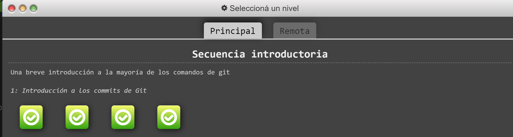

[Curriculum Vitae](CV.md)
### Linea modificadaHOLLALALALALALAL
[Qué es un pull request](pullrequest.md)

## **5 Mergear código con conflictos**

### Error al intentar pushear

### Error en la herramienta GitHub Desktop

### Como se ve al estar por mergear mediante vs code

REMOTE = El archivo local (modificaciones propias) 

LOCAL = El archivo remoto dentro del repositorio online (cambios hechos por otros)

BASE = El origen de ambos archivos (sin modificaciones)

### **Ejercicios resueltos**

